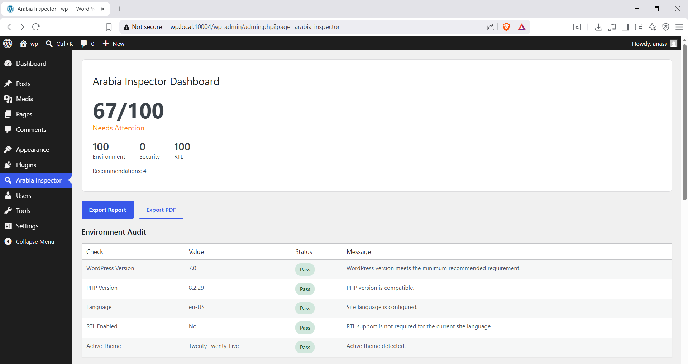
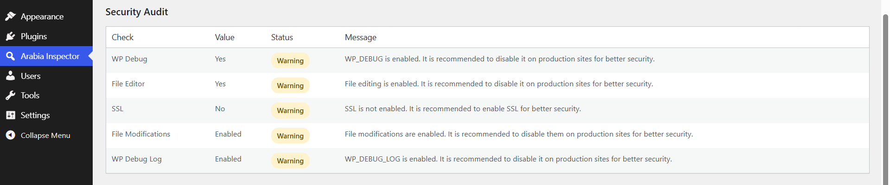
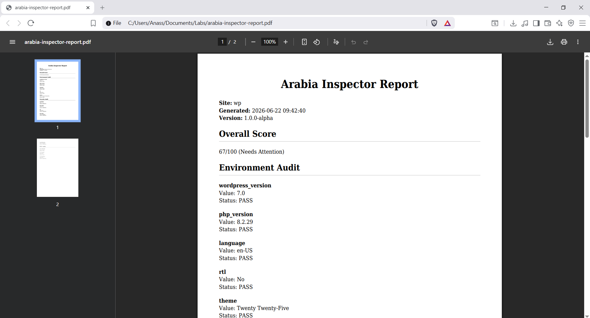

# Arabia Inspector

A WordPress auditing plugin designed to help developers, agencies, and site owners evaluate the quality, security, and Arabic/RTL readiness of their websites.

Arabia Inspector analyzes key aspects of a WordPress installation and generates actionable recommendations to improve compatibility, performance, security, and user experience for Arabic-language websites.

---

## Features

### Environment Audit

Checks core WordPress environment settings, including:

* WordPress version
* PHP version
* Active theme
* Site language
* RTL configuration

### Security Audit

Analyzes important security-related settings:

* WP_DEBUG status
* WP_DEBUG_LOG status
* File editor availability
* File modification settings
* SSL/HTTPS configuration

### RTL Audit

Evaluates right-to-left language support:

* Site language configuration
* RTL activation
* RTL stylesheet availability

### Recommendation Engine

Generates prioritized recommendations based on audit results.

Priority levels include:

* Critical
* Warning
* Information

### Report Exports

Generate downloadable reports in multiple formats:

* TXT Report Export
* PDF Report Export

All exports are generated from a centralized reporting architecture to ensure consistency across formats.

---

## Architecture

Arabia Inspector follows a modular architecture where audits remain independent from presentation and export layers.

```text
Audits
   │
   ▼
Report_Exporter
   │
   ├── Dashboard
   ├── TXT Export
   └── PDF Export
```

### Audit Modules

```text
includes/Audits/
├── Environment_Audit.php
├── Security_Audit.php
├── RTL_Audit.php
├── Recommendation_Audit.php
├── Score_Audit.php
├── Typography_Audit.php
└── WooCommerce_Audit.php
```

### Core Components

```text
includes/Core/
├── Plugin.php
├── Admin.php
└── Report_Exporter.php
```

### PDF Services

```text
includes/PDF/
└── PDF_Generator.php
```

---

## Requirements

* WordPress 6.0+
* PHP 7.4+
* Composer

---

## Installation

### Development Installation

Clone the repository:

```bash
git clone https://github.com/anassrahou/arabia-inspector.git
```

Install dependencies:

```bash
composer install
```

Activate the plugin from the WordPress admin dashboard.

---

## Usage

1. Navigate to:

```text
WordPress Admin → Arabia Inspector
```

2. Review audit results.

3. Download reports:

* Export TXT Report
* Export PDF Report

4. Apply recommendations to improve site quality and RTL readiness.

---

## Screenshots

### Dashboard Overview

<p align="center">
    
</p>

### Security audit Results

<p align="center">
    
</p>

### PDF Report Export

<p align="center">
    
</p>

---

## Development Notes

This project was built as a modular WordPress plugin using:

* PHP OOP
* Namespaces
* Composer
* WordPress Hooks API
* Service-Oriented Architecture
* Centralized Report Generation

The reporting system was designed so that new export formats can be added without duplicating audit logic.

Potential future export formats include:

* JSON
* CSV
* Email Reports
* Scheduled Reports

---

## Roadmap

### Version 1.2

#### Typography Audit

Planned checks:

* Arabic font compatibility
* Font loading strategy
* Readability recommendations
* Line-height analysis
* Typography consistency

#### WooCommerce Audit

Planned checks:

* Arabic storefront compatibility
* RTL product layouts
* Checkout RTL support
* Currency display validation
* Translation readiness

---

### Version 1.3

#### SEO Audit

Planned checks:

* Arabic SEO readiness
* Language metadata
* hreflang validation
* Open Graph configuration
* Structured data presence

#### Accessibility Audit

Planned checks:

* Heading structure
* Color contrast
* Image alt attributes
* Keyboard navigation support
* RTL accessibility considerations

---

### Version 1.4

#### Advanced Reporting

* JSON export
* CSV export
* Email reports
* Scheduled audits
* Historical audit tracking

---

## Contributing

Contributions, feedback, and feature suggestions are welcome.

Please open an issue or submit a pull request.

---

## License

GPL-2.0-or-later

---

## Author

Anass Rahou

Programming, WordPress development, web and cybersecurity technologies, and developer tooling.
